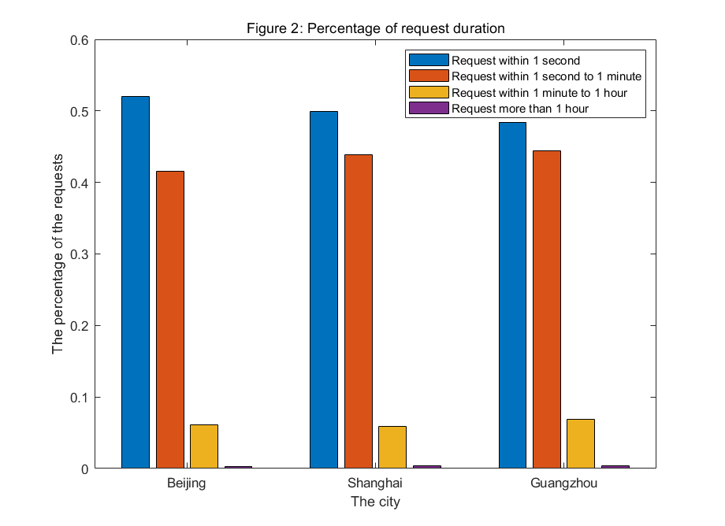

# About Edge Computing Dataset

This dataset is from ISP in china and is publicly released for researches in Edge Computing. The dataset not only contains base station location and user access time,  **but also records URLs, server ports and gateway IP for service/applications, which are important for edge computing researches.** 

# Analysis of the Dataset

The following figures show some statistical results obtained from the dataset. 

The average number of requests sent by each user in the month is shown in Figure 1. 

In Figure 2, the requests are classified into four categories according to their duration.

# Parameter Description

This dataset provides over 480,000 records of mobile users through 16,000 base stations from Beijing, Shanghai and Guangzhou.  The parameters and their descriptions are listed in the following table. The URL field of some records is vacant because it is a HTTPS link. In order to protect user privacy, some sensitive information has been processed.

|  ID  |                Parameter Name                 |                         Description                          |
| :--: | :-------------------------------------------: | :----------------------------------------------------------: |
|  1   |                 Phone Number                  |                    Encrypted phone number                    |
|  2   |            Location Area Code(LAC)            | LAC is the unique number given to each location area within the network |
|  3   |               Cell Identity(CI)               | CI is the unique code allocated to each cell. LAC and CI identity each cell in the world |
|  4   |            Access Point Name(APN)             | APN identifies the packet data network that a mobile data user wants to communicate with |
|  5   | International Mobile Equipment Identity(IMEI) | IMEI is a unique number to identify mobile phones. The IMEI in dataset is processed to protect privacy |
|  6   |                    SGSN IP                    | The IP address of Service GPRS Support Node which is responsible for the delivery of data packets from and to the mobile stations within its geographical service area |
|  7   |                    GGSN IP                    | The IP address of Gateway GPRS Support Node which converts the incoming data traffic coming from the mobile users through the SGSN and forwards it to the relevant network |
|  8   |                  Start Time                   |          The time when a network connection starts           |
|  9   |                   End Time                    |           The time when a network connection ends            |
|  10  |                   Duration                    |             The duration of a network connection             |
|  11  |                Uplink traffic                 | The number of bytes sent by user equipment of an uplink network connection |
|  12  |               Downlink traffic                | The number of bytes that user equipment recieve from an downlink network connection |
|  13  |            Radio Access Type(RAT)             |    The code used to identify the radio access technology     |
|  14  |                   Source IP                   |                  The IP of the source node                   |
|  15  |                  Source Port                  |                 The port of the source node                  |
|  16  |                Destination IP                 |                The IP of the destination node                |
|  17  |               Destination Port                |               The port of the destination node               |
|  18  |                  Status Code                  |                    The state code of HTTP                    |
|  19  |                      URL                      | The url of the connection, which can be used to identify what service the user is using |
|  20  |                  User Agent                   |               The web browser user agent type                |
|  21  |                 Content-Type                  |      The content type information of an HTTP connection      |
|  22  |                     Date                      |                    The date of one record                    |

# Dataset Citation

If you have used the dataset, we would appreciate citations to the following paper:

- Haojiang Liu, Yuanzhe Li, Shangguang Wang. Request Scheduling Combined with Load Balancing in Mobile Edge Computing. IEEE Internet of Things Journal, 2022
